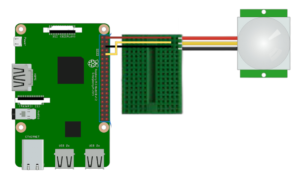

# Smart-Mail-Box
In this project, I created an IoT system that uses a Raspberry Pi and a motion sensor to send notifications when a mailbox has received mail. This can be useful for individuals who are unable to check their mailbox regularly or who want to be notified as soon as possible when they receive mail.

This code is written in Python and is designed to run on a Raspberry Pi. When executed, it will monitor a mailbox connected to the Raspberry Pi and send an email notification when mail is detected. The code can be broken down into the following steps:

1. Import the necessary libraries: RPi.GPIO, time, and smtplib. These libraries are used to interact with the Raspberry Pi's GPIO pins, pause the script for a specified amount of time, and send email notifications.

2. Use the "BOARD" numbering system to reference the physical pin numbers on the Raspberry Pi's board. This is done by calling the setmode() method of the RPi.GPIO library and passing in the constant "GPIO.BOARD". This allows the script to reference the physical pin numbers on the board instead of the Broadcom SOC channel numbers.

3. Set up pin 10 as an input pin and set its initial value to be pulled low (off). This is done by calling the setup() method of the RPi.GPIO library, passing in the pin number (10), the pin mode (GPIO.IN) and the pull_up_down option (GPIO.PUD_DOWN). The pull_up_down option is used to set the initial state of the pin when it is first configured. By setting it to "GPIO.PUD_DOWN", the pin is set to low or off, which makes it suitable for detecting if the mailbox is open or closed.

4. Define a function called "send_email()", which sends an email using the smtplib library. The function specifies the sender and receiver email addresses, and uses a hard-coded password to login to the Gmail account. The function then sends a message and sends an email, and quits the smtp server. The message is hardcoded and will be the same for all emails sent. The script uses the "smtp.gmail.com" server to send the email and the port 587.

5. The email notification message in the code is written in a fun and creative way to make it more engaging for the recipient. The message starts with a catchy subject line "Snail Mail Notification" which immediately grabs the recipient's attention, it continues to have a creative message that describes the excitement of receiving mail. It creates a feeling of anticipation and excitement for the recipient, making them more likely to check their mailbox.

6. Run an infinite loop to check the status of the mailbox by checking the input from pin 10. If the mailbox is open, the script will run the send_email function and sleep for 600 seconds before checking again. If the mailbox is closed, the script will sleep for 0.5 seconds before checking again. The script will continuously check the mailbox status, until it is manually stopped or a keyboard interrupt is issued.

The code sleeps for 600 seconds (10 minutes) after the send_email() function is called because it is waiting for a certain amount of time before checking the status of the input pin again. The reason for this is to prevent multiple emails from being sent if the motion sensor is triggered multiple times within a short period of time. By waiting for 10 minutes after an email is sent, the script gives the user enough time to retrieve their mail and prevent multiple unnecessary emails. Additionally, a delay in the code also helps reduce the chances of the server being overloaded with too many requests in a short time. This would prevent the server from crashing and keep the system running smoothly.

